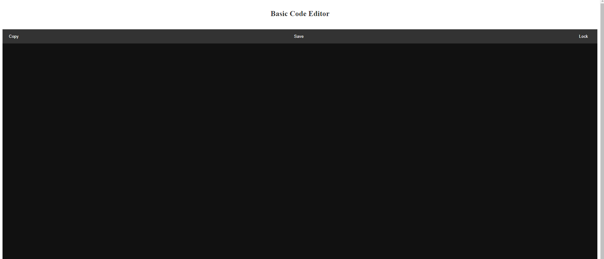

# Basic Code Editor

Basic Code Editor is a simple web-based code editor that allows you to write and edit code snippets with essential features. It is designed for quick code editing tasks and offers basic functionalities like copying code, saving your work, and locking the editor to prevent further changes. Additionally, it supports a dark mode for improved readability in low-light environments.

## Features

- Code editing with basic text manipulation functions.
- Copy code to the clipboard with a single click.
- Save your code to your local device.
- Lock/unlock the editor to prevent accidental changes.
- Dark mode for a comfortable coding experience at night.

## Usage

1. Clone the repository to your local machine.
2. Open the `index.html` file in your web browser.
3. You'll see the Basic Code Editor interface.
4. Use the provided buttons and editor for your code editing needs.
5. You can toggle the dark mode by clicking the "Dark Mode" button.

## Customization

You can customize the code editor further by editing the HTML, CSS, and JavaScript files:

- `index.html`: Adjust the layout and structure of the editor.
- `styles.css`: Modify the styling, colors, and themes.
- `script.js`: Enhance or add more features to the editor.

## Contributing

Contributions to improve the Basic Code Editor are welcome. If you have any ideas, bug fixes, or improvements, please submit a pull request with your changes.

1. Fork the repository.
2. Create a new branch with a descriptive name.
3. Make your changes and test them.
4. Submit a pull request with a clear description of your changes.

## License

This code editor is provided under the MIT License. Feel free to use and modify it for your purposes. For more details, please see the [LICENSE](LICENSE) file.

## Contact

If you have any questions, issues, or suggestions, feel free to reach out via [email@example.com](mailto:email@example.com).

Enjoy coding with Basic Code Editor!
